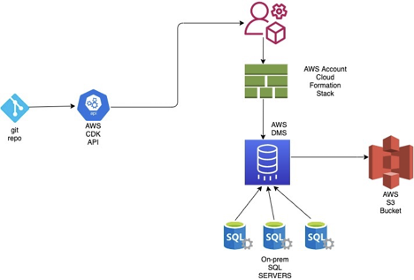
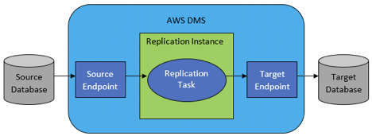
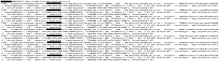
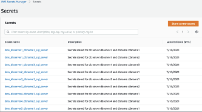
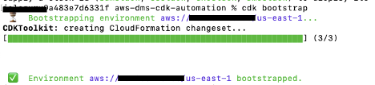
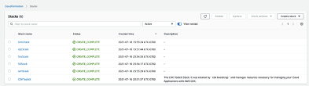
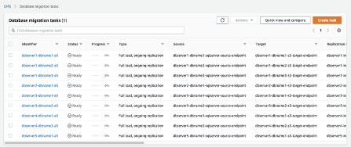

This package contains the automation approach for deploying multiple DMS tasks for several database instances and databases in a very few simple steps using AWS CDK APIs & AWS Boto3 APIs. As an example, Microsoft SQL SERVER DB was taken as source for the source data and AWS S3 as a target. 

**What does this DMS-CDK approach provides?**

1.	Reduce the manual effort in creating migration task(s), Source end-point, target end-point and replication instances for database(s) that needs migration to S3 or other targets.

2.	Ability to scale incremental database migrations by adding database details to parameter file with no code changes.

3.	Simplify the multi-stage process of creating DMS tasks as a single step.

4.	Create secrets in AWS secret manager for storing the credentials securely.

5.	Start the DMS task using a python-based script instead to run each task manually from console.

**Assumptions:**
Since this is a demo purpose, there is no source database is configured and have added dummy host details to the DMS tasks. It is assumed that you will have a source database configured and enable the replications for the required tables on the source database. Please refer the link for Using a Microsoft SQL Server database as a source for AWS DMS.

****Architecuture****:

Following are the steps/items that needs to be created from console before start DMS task and this package will deploy each service as a separate stack under the target AWS account.

1.	A VPC with a CIDR block and atleast two subnets with different AZ(availability zones)
2.	A subnet group under DMS service for launching the DMS instance.
3.	A source end point with source connection details like HOST IP, DB user name, DB password, port.
4.	A target end point with target details like S3 bucket.
5.	A Service access role ARN that have access to S3 bucket.

Pre-requisites: Following are the pre-requisites before you execute this package.
1.	Aws CLI installed with credentials. If not, please follow the [link](https://docs.aws.amazon.com/cli/latest/userguide/install-cliv2.html) to install it.
2.	Aws CDK CLI installed. If not, please follow the [link](https://docs.aws.amazon.com/cdk/latest/guide/cli.html) to install the AWS CDK.
3.	Python2 or later version installed.
4.	An AWS account with an IAM user having permissions for services DMS, S3 or you can create an Admin user with super privileges.

Once the pre-requisites satisfied, clone the package from gitlab [link](https://gitlab.aws.dev/proserve-canada-sdt/proserve-canada-sdt-intelligence/aws-dms-cdk-automation) .

********Things to consider before you start running this package********

1.	File Name: 
~/aws_dms_cdk_automation/aws-dms-cdk-automation/resources/config/parameters.txt file

    This file contains few parameters that will be used while creating the DMS task/instance and can be modified to lower or higher depends on your need and use-case.
    a.	Instance size: dms.r5.xlarge. 
    b.	Maxfilesize – 4096. This configuration limits the file size. A value that specifies the maximum size (in KB) which is 4 MB in this case.
    c.	task_migration_type: full-load-and-cdc.  This configure enables the task with both full-load and incremental changes.

2.	File: ~/aws_dms_cdk_automation/aws-dms-cdk-automation/resources/config/parameters.txt file
    This file contains the database server name and database name for which the tasks will be created. The tasks names, source end point, target end point will be creating using 
    the database instance name and database name to distinguish each task. Again, these are dummy values and can be modified with on-prem db details.
    Eg:
    DMS task name: dbserver1-dbname1-all
    DMS task source end point: dbserver1-dbname1-sqlserver-source-endpoint
    DMS task target end point: dbserver1-dbname1-s3-target-endpoint

3.	Files: ~/aws_dms_cdk_automation/aws-dms-cdk-automation/resources/config/dms_json_mappings/*.json

    These are the files that contains the schema name, table name for each database that will be added to DMS task for pulling transactions from the databases. 
    For demo purpose, I have added dummy schema names and table names. If you are adding actual database details then modify the each json with schema and table details.

4.	VPC: 
    As a demo purpose, this CDK was configured to create the DMS instances in CIDR block range – 10.0.0.0/18. 
    The block can be modified to your need from file - ~/aws_dms_cdk_automation/aws-dms-cdk-automation/dms-cdk/vpc.py.

5.	The package also deploys one DMS instance for each Database instance to handle the migration process. That means if one database instance has multiple databases and all these databases will run under one replication instance.
    Advantages of this doing this way?
        1.	we can reduce the instance idle time. 2.
        2.	Dedicate one DMS instance per DB server that reduces the dependency or failure of other DB servers. 3.
        3.	Load will be distributed to multiple DMS instances.
        4.	DMS monthly usage cost can be reduced by avoid creating one DMS instance per one database.

**Let’s Start the actual run.**

> Step 1: Create secrets for source database in AWS Secrets Manager to store the credentials securely.

As per AWS best practices, it is not advisable to add any credentials in the code. So we will add database credentials to a file and run the below adhoc script to create the secrets under Secrets Manager. These credentials will be added to DMS source end points while deploying DMS tasks.

1.	Go to location using cd ~/aws_dms_cdk_automation/aws-dms-cdk-automation/resources/adhoc_scripts and modify file credentials.csv with the database details, otherwise for test we have added dummy source connection details for demo purpose.

2.	Then run the python file using below command:
Command: python3 create_secrets.py
This script will create one secret for each in the credentials.csv file.

    Output:

    

3. Login to AWS console and validate if the secrets were created under Secrets Manager.

    

> Step 2
**CDk deployment**
> 
1.	cd ~/aws_dms_cdk_automation/aws-dms-cdk-automation
2.	Check the stacks that will be deployed as part of this package.

    aws-dms-cdk-automation % cdk ls
    IamStack
    S3Stack
    SnsStack
    DmsStack

3. AWS CDK apps are effectively only a definition of your infrastructure using code. When CDK apps are executed, they produce (or “synthesize”, in CDK parlance) an AWS CloudFormation template for each stack defined in your application.
To synthesize a CDK app, use the cdk synth command.

    Command : cdk synth

    Output :  Successfully synthesized to ~/aws_dms_cdk_automation/aws-dms-cdk-automation/cdk.out
    Supply a stack id (IamStack, S3Stack, SnsStack, DmsStack) to display its template.

4. Bootstrapping an environment:
The first time you deploy an AWS CDK app into an environment (account/region), you’ll need to install a “bootstrap stack”. This stack includes resources that are needed for the toolkit’s operation. For example, the stack includes an S3 bucket that is used to store templates and assets during the deployment process.

    Command : cdk bootstrap

    Output:
    
    

5. Final step to deploy the stacks to AWS account to deploy all stacks that are shown in bullet 2.

Command : cdk deploy --all

Output:

IamStack

This deployment will make potentially sensitive changes according to your current security approval level (--require-approval broadening).
Please confirm you intend to make the following modifications:

IAM Statement Changes

    ┌───┬──────────────────────────────────┬────────┬────────────────┬───────────────────────────┬───────────┐
    │   │ Resource                         │ Effect │ Action         │ Principal                 │ Condition │
    ├───┼──────────────────────────────────┼────────┼────────────────┼───────────────────────────┼───────────┤
    │ + │ ${dms_target_s3_access_role.Arn} │ Allow  │ sts:AssumeRole │ Service:dms.amazonaws.com │           │
    └───┴──────────────────────────────────┴────────┴────────────────┴───────────────────────────┴───────────┘

IAM Policy Changes

    ┌───┬──────────────────────────────┬──────────────────────────────────────────────────────────┐
    │   │ Resource                     │ Managed Policy ARN                                       │
    ├───┼──────────────────────────────┼──────────────────────────────────────────────────────────┤
    │ + │ ${dms_target_s3_access_role} │ arn:${AWS::Partition}:iam::aws:policy/AmazonS3FullAccess │
    └───┴──────────────────────────────┴──────────────────────────────────────────────────────────┘

(NOTE: There may be security-related changes not in this list. See https://github.com/aws/aws-cdk/issues/1299)

Do you wish to deploy these changes (y/n)? 

Hit “y” to deploy the stacks

IamStack: deploying...
IamStack: creating CloudFormation changeset...
[███████████████████████████████████████████] (3/3)

✅  IamStack

Outputs:
IamStack.ExportsOutputFnGetAttdmstargets3accessrole822BADB8ArnA1860007 = arn:aws:iam::XXXXXXXXXX:role/IamStack-dmstargets3accessrole822BADB8-JKYJVBF0ON54

Stack ARN:
arn:aws:cloudformation:us-east-1:XXXXXXXXXX:stack/IamStack/b0f66760-e6cb-11eb-a473-12193276ecaf
S3Stack
S3Stack: deploying...
S3Stack: creating CloudFormation changeset...
[████████████████████████████████████████████] (3/3)
 ✅  S3Stack

Outputs:
S3Stack.ExportsOutputRefdatalakestageE371C16F5225D959 = s3stack-datalakestagee371c16f-juwk2i0wg6gr

Stack ARN:
arn:aws:cloudformation:us-east-1:XXXXXXXXXXXX:stack/S3Stack/cdd1cb40-e6cb-11eb-b6b8-0e2e9aec3a21
SnsStack
SnsStack: deploying...
SnsStack: creating CloudFormation changeset...
[███████████████████████████████████████████] (4/4)

✅  SnsStack

Outputs:
SnsStack.ExportsOutputRefSNSAlertEmailTopicFB2E864A4FB63AE1 = arn:aws:sns:us-east-1:XXXXXXXXXX:dms-failure-alert-topic

Stack ARN:
arn:aws:cloudformation:us-east-1:XXXXXXXXXX:stack/SnsStack/e472cb10-e6cb-11eb-8cc0-0e4c8b1e1e5f
	VpcStack
VpcStack: deploying...
VpcStack: creating CloudFormation changeset...
[█████████████████████████████████████] (31/31)

✅VpcStack

Outputs:
VpcStack.ExportsOutputFnGetAttvpcA2121C38DefaultSecurityGroupA3940787 = sg-06112dcbedc0677d4
VpcStack.ExportsOutputRefvpcprivateSubnet1SubnetAE1393DC18E7B349 = subnet-01d29c629da3de860
VpcStack.ExportsOutputRefvpcprivateSubnet2Subnet1C8B0CEE5A404381 = subnet-0d2e04c7cab9dcdac

Stack ARN:
arn:aws:cloudformation:us-east-1:467286116285:stack/VpcStack/f5e1ae90-e809-11eb-ace6-0acbfa2a24c9
DmsStack: creating CloudFormation changeset...
[██████████████████████████████████████] (37/37)

 ✅  DmsStack

CloudFormation Stacks which got deployed as part of this package:

 

DMS Tasks that got deployed as part of package:

> Step 3: Start the DMS tasks which got deployed in the previous step.

As mentioned earlier AWS CDK only sets up physical infrastructure and turning on/off a particular AWS service should be either thru another automated approach or manually from the console.

To start all the DMS tasks that have got deployed as part of the package, execute the following script. 

What does this script provide?
1.	Modify the task to enable cloud watch logs since AWS CDK API does not support directly. Script poll DMS task for 15 secs to validate if the DMS modification is completed or not. 
2.	Once DMS modification completed then script starts the DMS task.

To run the script, please follow the below steps:

1.	Go to location using cd ~/aws_dms_cdk_automation/aws-dms-cdk-automation/resources/adhoc_scripts and keep the credentials.csv in the same location with the database names
2.	Execute the script Invoke_dms_tasks.py using the below command.
Command: python3 invoke_dms_tasks.py

> Step 4 : Cleanup

Don’t forget to cleanup all resources deployed as part of this package to avoid unexpected charges to your account, make sure you clean up your CDK stack.

1.	You can delete the stacks through the AWS CloudFormation Console or
2.	Run the below command-line to remove all the stacks

Command: cdk destroy --all

Output:
Are you sure you want to delete: DmsStack, VpcStack, SnsStack, S3Stack, IamStack (y/n)?	
Hit “y” and you’ll see your stacks being destroyed

****Conclusion*****

Using AWS CDK APIs, it is easy to automate the process of deploying the DMS tasks with few lines of code and can scale the deployments for multiple databases.

 
